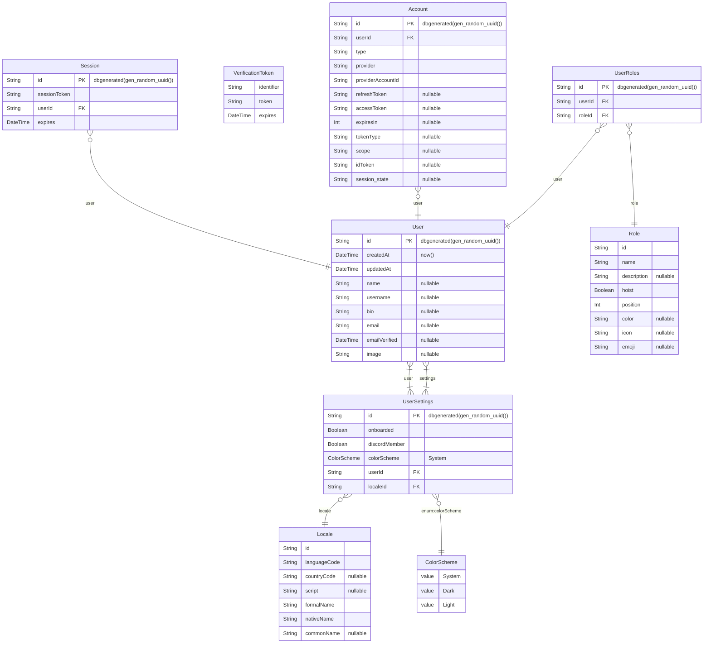

# Code Fest

Code Fest is an open-source project aimed at fostering collaboration and learning through coding challenges, hackathons, and community-driven development. Whether you're a seasoned developer or a coding enthusiast, this repository provides a variety of fun and engaging coding exercises, real-world projects, and resources to enhance your skills.

## Table of Contents

- [Code Fest](#code-fest)
  - [Table of Contents](#table-of-contents)
  - [Features](#features)
  - [Tech Stack](#tech-stack)
  - [Database Design](#database-design)
  - [Developing](#developing)
  - [Building](#building)

## Features

- TBA

## Tech Stack

- TBA

## Database Design



## Developing

```bash
npm run dev

# or start the server and open the app in a new browser tab
npm run dev -- --open
```

## Building

To create a production version of your app:

```bash
npm run build
```

You can preview the production build with `npm run preview`.